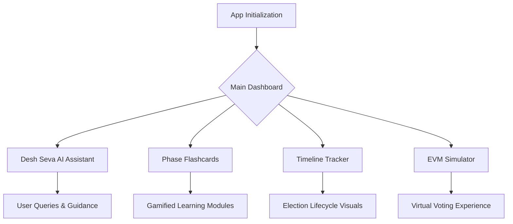
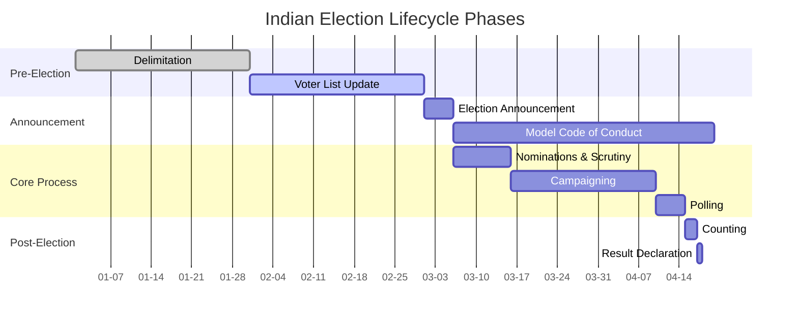

# Desh Seva App

An interactive, comprehensive election education platform and AI assistant designed to prepare citizens for the Indian democratic process. It provides contextual guidance, gamified learning, and interactive visualization tools to make learning about elections engaging and accessible.

## 🚀 Live Demo
**[Click here to view the Live Application](https://desh-seva-858067523048.us-central1.run.app/)** 

## 🌟 Features in Detail

- **Desh Seva AI Assistant:** A specialized contextual chatbot that helps users navigate complex election-related queries in real-time.
- **Phase Flashcards:** A gamification module utilizing interactive flashcards to educate users on different election phases, testing their knowledge dynamically.
- **Timeline Tracker:** A visual, step-by-step tracking system of the entire election lifecycle, from delimitation to the final result declaration.
- **Know Your Candidate:** Integrated tools and resources to help voters learn more about their local representatives and their track records.
- **EVM Simulator:** A hands-on, virtual experience with Electronic Voting Machines to familiarize first-time voters with the physical process of casting a vote.
- **Myth-Busting Content:** Dedicated sections aimed at combating misinformation and clarifying common misconceptions regarding the democratic process.

## 📊 Project Architecture & Flow



## 📈 Election Lifecycle Graph

Below is the detailed timeline structure used to educate voters on the phases of the election:



## 🛠️ Technology Stack
- **Frontend Framework:** React 19, Vite
- **Styling:** CSS3 (Custom responsive design)
- **Icons:** Lucide React
- **Deployment & Server:** Docker, Nginx, Google Cloud Run (based on the live server URL)

## 📦 Getting Started

### Prerequisites
Make sure you have [Node.js](https://nodejs.org/) installed on your machine.

### Installation

1. **Clone the repository:**
   ```bash
   git clone https://github.com/offxronit121/desh-seva.git
   cd desh-seva
   ```

2. **Install dependencies:**
   ```bash
   npm install
   ```

3. **Start the development server:**
   ```bash
   npm run dev
   ```
   This will start the app using Vite. Open `http://localhost:5173` to view it in the browser.

### Building for Production
To build the app for production to the `dist` folder, run:
```bash
npm run build
```

To preview the production build locally:
```bash
npm run preview
```

## 🤝 Contributing
Contributions are welcome! Feel free to open issues or submit pull requests to help improve the project.

## 📝 License
This project is open-source and available under the [MIT License](LICENSE).

---
**Author:** Gaurav Shiswar
