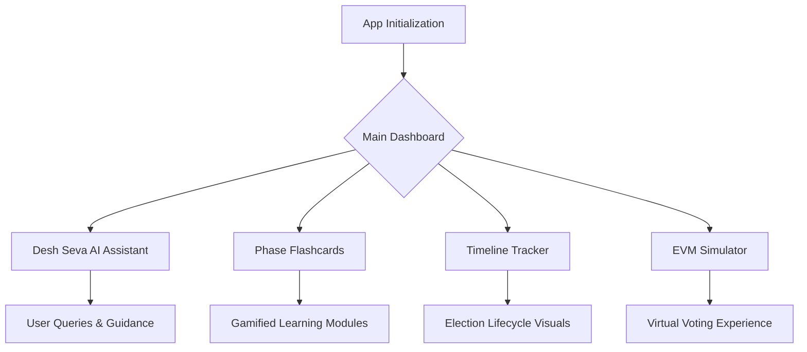
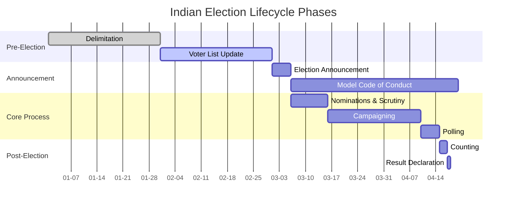

# Desh Seva App

An interactive election education platform and AI assistant designed to prepare citizens for the Indian democratic process through contextual guidance, gamification, and interactive visualization tools.

## 🚀 Live Demo
**[Insert Your Live Server Link Here]** *(Please replace this placeholder with your actual deployed URL)*

## 🌟 Features
- **Desh Seva AI Assistant:** Contextual guidance and answers to election-related queries.
- **Phase Flashcards:** A gamification module to educate users on different election phases.
- **Timeline Tracker:** Visual tracking of the election lifecycle.
- **Know Your Candidate:** Tools to learn more about the representatives.
- **EVM Simulator:** Hands-on virtual experience with Electronic Voting Machines.
- **Myth-Busting Content:** Combating misinformation regarding the democratic process.

## 📊 Project Flowchart



## 📈 Election Lifecycle Graph

Below is a representation of the election phases covered in the timeline tracker:



## 🛠️ Technology Stack
- **Frontend:** React, Vite
- **Styling:** CSS
- **Icons:** Lucide React

## 📦 Getting Started

### Prerequisites
Make sure you have [Node.js](https://nodejs.org/) installed on your machine.

### Installation

1. **Clone the repository:**
   ```bash
   git clone <YOUR_GITHUB_REPO_URL>
   cd current
   ```

2. **Install dependencies:**
   ```bash
   npm install
   ```

3. **Start the development server:**
   ```bash
   npm run dev
   ```
   This will start the app using Vite. Open `http://localhost:5173` to view it in the browser.

### Building for Production
To build the app for production to the `dist` folder, run:
```bash
npm run build
```

To preview the production build locally:
```bash
npm run preview
```

## 🤝 Contributing
Contributions are welcome! Feel free to open issues or submit pull requests.

## 📝 License
This project is open-source and available under the [MIT License](LICENSE).
